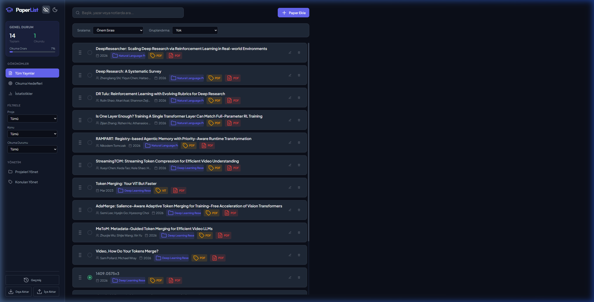
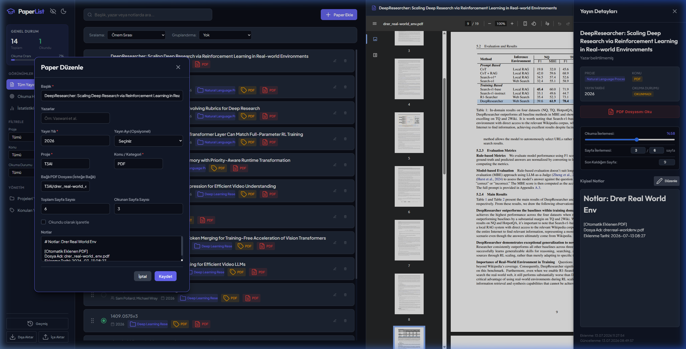
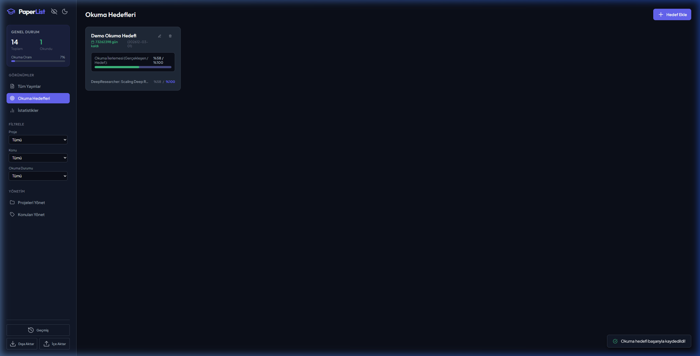

# Akademik Yayın ve Makale Takip Günlüğü (Article Diary)

Akademik makalelerinizi, araştırmalarınızı ve okuma hedeflerinizi yerel olarak yönetebileceğiniz, modern ve zengin arayüze sahip web tabanlı bir **Makale Takip Günlüğü** uygulamasıdır.

---

## 🖼️ Uygulama Arayüzü (Ekran Görüntüleri)

### 1. Ana Kontrol Paneli (Sunum Modunda Maskelenmiş Görünüm)


### 2. Yan Yana Düzenleme Modu (Transcribing Mode)


### 3. Okuma Hedefleri Panosu (Goals Dashboard)


Bu uygulama hem **bağımsız sunucusuz modda** (doğrudan `index.html` dosyası üzerinden tarayıcı hafızasında) hem de **yerel Python sunucusuyla** (klasör senkronizasyonu ve otomatik dosya organizasyonu ile) çalışacak şekilde çift katmanlı tasarlanmıştır.

---

## 🚀 Öne Çıkan Özellikler

### 1. Otomatik PDF Tarama ve Sayfa Sayısı Tespiti
*   `pdfs/` dizinine yerleştirdiğiniz PDF dosyaları sunucu tarafından anında tespit edilerek veritabanına eklenir.
*   PDF dosyasının ikili (binary) üstbilgi yapısı analiz edilerek **toplam sayfa sayısı otomatik olarak algılanır**.

### 2. Akıllı Klasör ve Proje Organizasyonu
*   `pdfs/` dizini altında oluşturduğunuz alt klasörler (örn: `pdfs/NLP/makale.pdf`) birer **Proje** olarak tanınır ve o kategorideki makaleler otomatik olarak ilgili projeye atanır.
*   Arayüz üzerinden bir makalenin projesini değiştirdiğinizde (örn: *"NLP"* projesinden *"Scaling"* projesine taşıdığınızda), sunucu yerel diskteki PDF dosyasını otomatik olarak ilgili alt klasörün altına taşır ve veritabanı yollarını günceller. Boşalan eski klasörler temizlenir.

### 3. Çift Yönlü Sayfa İlerlemesi ve Durum Senkronizasyonu
*   Detay çekmecesindeki **"Sayfa İlerlemesi"** (`Okunan Sayfa / Toplam Sayfa`) bölümü sayesinde okuma durumunuzu sayfa sayısına göre takip edebilirsiniz.
*   **Çift Yönlü Bağlama (Two-Way Binding):** Okuduğunuz sayfa sayısını değiştirdiğinizde okuma yüzdesi otomatik hesaplanır; ilerleme sürgüsünü (slider) kaydırdığınızda ise okunan sayfa sayısı dinamik olarak güncellenir.
*   Yüzde veya sayfa sayısı tamama ulaştığında yayın otomatik olarak **Okundu** işaretlenir.

### 4. Kaldığı Sayfadan Devam Etme (Deep-linking)
*   Entegre iki panelli (split-screen) PDF gösterici sayesinde makaleyi okurken kaldığınız sayfa numarası kaydedilir.
*   PDF dosyası bir sonraki açılışında, tarayıcıda doğrudan hash yönlendirmesiyle (`#page=N`) **kaldığınız sayfadan otomatik olarak açılır**.

### 5. Yan Yana Düzenleme Modu (Transcribing Mode)
*   Yayın düzenleme modalı açıldığında arka plan bulanıklaştırılmaz veya karartılmaz. Modal ekranın soluna hizalanarak açılır.
*   Gelişmiş arayüz özellikleri sayesinde düzenleme modalı açıkken sağ paneldeki PDF'i okumaya, kaydırmaya ve incelemeye devam edebilir; başlık, yazar ve yıl bilgilerini sol taraftaki forma rahatça yazabilirsiniz.

### 6. Markdown Destekli Kişisel Notlar
*   Her makale için zengin metin düzenleme (edit/preview) özelliklerine sahip kişisel notlar tutabilirsiniz. Not alanı **Markdown** formatını destekler ve yazarken otomatik olarak kaydedilir.

### 7. Takvime Bağlı Okuma Hedefleri (Goals Dashboard)
*   Belirli hedefler için takvime bağlı okuma hedefleri tanımlayabilirsiniz.
*   Hedefe dahil ettiğiniz her makale için hedef okuma yüzdeleri (örn: `%80` veya `%100`) belirleyebilirsiniz.
*   Karşılaştırmalı durum çubukları sayesinde hedef ilerlemenizi ve kalan günlerinizi dinamik uyarı renkleriyle takip edebilirsiniz.

---

## 🛠️ Kurulum ve Çalıştırma

Uygulamayı çalıştırmak için iki seçeneğiniz vardır:

### A Seçeneği: Yerel Sunucu Modu (Tavsiye Edilen)
PDF dosyalarını yan yana okumak, klasör taraması yapmak ve otomatik dosya taşıma gibi gelişmiş özellikleri kullanmak için yerel sunucuyu çalıştırın:

1.  Bilgisayarınızda Python yüklü olduğundan emin olun.
2.  Proje klasöründe bir uçbirim (terminal) açıp sunucuyu başlatın:
    ```bash
    python server.py
    ```
3.  Tarayıcınızda [http://localhost:3000](http://localhost:3000) adresine gidin.

### B Seçeneği: Sunucusuz Mod (Hızlı Başlangıç)
Makale verilerinizi, notlarınızı ve okuma hedeflerinizi yönetmek için sunucu kurmadan doğrudan tarayıcı hafızasını kullanabilirsiniz:

*   **`index.html`** dosyasına çift tıklayarak tarayıcınızda açın. Verileriniz tarayıcının `localStorage` alanında güvenle saklanır.

---

## 💾 Yedekleme ve Taşıma

*   Arayüzdeki sol alt panelde bulunan **"Geçmiş"** butonuna tıklayarak son 5 yedek noktasına geri dönebilirsiniz (tarayıcı rolling backup).
*   **"Dışa Aktar"** butonu ile tüm verilerinizi, hedeflerinizi ve notlarınızı tek bir `JSON` yedek dosyası olarak indirebilirsiniz. 
*   **"İçe Aktar"** butonu ile daha önce aldığınız yedeği yükleyerek başka bir tarayıcıda veya bilgisayarda kaldığınız yerden devam edebilirsiniz.
